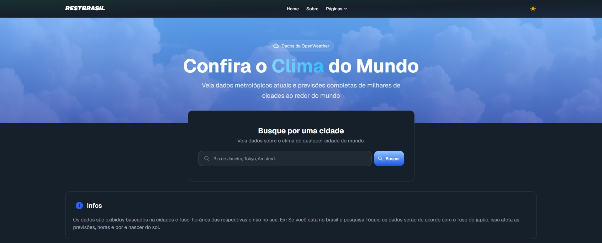
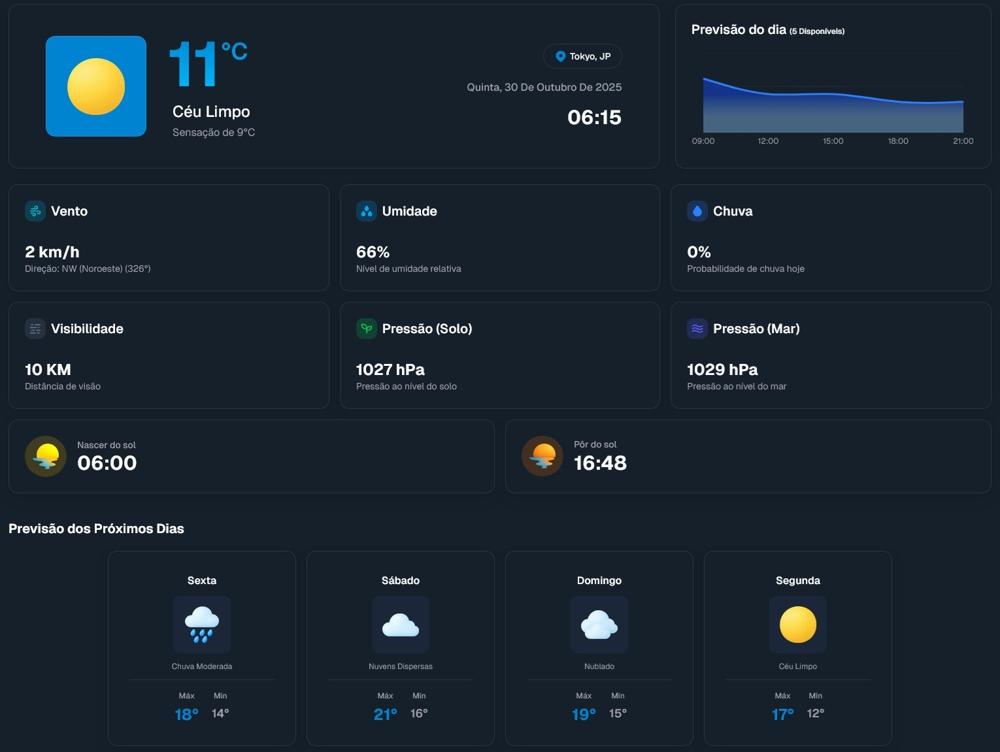

#  RESTBRASIL

O RESTBRASIL é um projeto que visa centralizar diversas APIs em um só lugar,
apresentando seus dados de forma intuitiva e acessível através de dashboards
interativos. O objetivo é facilitar a consulta e a visualização de informações
de diferentes fontes em um único local.

## 🛠️ Tecnologias Utilizadas

[](https://reactjs.org/)
[](https://nextjs.org/)
[](https://ui.shadcn.com/)
[](https://developer.mozilla.org/en-US/docs/Web/JavaScript)
[](https://www.typescriptlang.org/)
[](https://tailwindcss.com/)

## 🚀 Funcionalidades

- **Dashboards interativos:** cada API possui sua própria página com um
  dashboard dedicado para a visualização dos dados.
- **Interface responsiva:** a aplicação é totalmente responsiva, adaptando-se a
  diferentes tamanhos de tela.
- **Temas:** duas opções de tema — claro e escuro — que podem ser alterados no
  menu.
- **Fácil de usar:** basta navegar pelo menu para acessar a API desejada e
  começar a explorar.

## 🌐 APIs disponíveis

Atualmente, o projeto integra as seguintes APIs:

### 1. 📍 Consulta de CEP

Encontre informações detalhadas de endereços a partir de um CEP. O dashboard
exibe o endereço completo, incluindo rua, bairro, cidade, estado e DDD.

### 2. ⛅ Previsão do tempo (clima)

Consulte a previsão do tempo para qualquer cidade do Brasil. Esta é a nossa
dashboard mais completa, oferecendo:

- **Visão geral do tempo:** informações atuais sobre temperatura, sensação
  térmica, umidade, velocidade do vento e visibilidade.
- **Previsão para as próximas horas:** um gráfico interativo mostrando a
  variação da temperatura ao longo do dia.
- **Previsão para os próximos dias:** um carrossel com a previsão para os
  próximos 5 dias, incluindo ícones representativos do clima e as temperaturas
  máxima e mínima.
- **Dados adicionais:** horários do nascer e do pôr do sol.

### 3. 📈 Popularidade de nomes

Analise a frequência e a popularidade de nomes no Brasil ao longo das décadas,
com base nos dados do IBGE. O dashboard apresenta:

- **Gráfico de frequência:** um gráfico de barras que mostra a popularidade do
  nome em diferentes décadas.
- **Tabela de dados:** uma tabela com os dados brutos de frequência por período
  e mais.

### 4. 🗺️ Informações de países

Obtenha informações detalhadas sobre todos os países do mundo, como capital,
população, área, moeda, idiomas e bandeira, entre outras.

## 💡 Exemplo de uso de uma página

### 1. Navegue até a página desejada

Nesse exemplo vamos usar a página de clima (`http://127.0.0.1:3000/clima`).

### 2. Você verá um input para a pesquisa e um card com dicas e informações sobre a API



### 3. Após a pesquisa, os dados aparecerão distribuídos nos cards



## 💻 Como rodar o projeto

1.  **Clone o repositório:**

    ```bash
    git clone https://github.com/seu-usuario/rest-brasil.git
    ```

2.  **Instale as dependências:**

    ```bash
    npm install
    ```

3.  **Configure as variáveis de ambiente:**

    Crie um arquivo `.env` na raiz do projeto, copie o `.env-example` para
    dentro do `.env` e preencha as variáveis necessárias.

4.  **Inicie o servidor de desenvolvimento:**

    ```bash
    npm run dev
    ```

## ⚠️ Aviso

Todas as APIs utilizadas nesse projeto são gratuitas, porém possuem
`rate limit`; ultrapassar esse limite resultará em bloqueio das requisições,
impedindo o site de funcionar corretamente.

Se você precisa de maior limite, confira os planos disponíveis nas documentações
ou sites das APIs. Abaixo seguem os links para referência:

- [ViaCEP](https://viacep.com.br/)
- [REST Countries](https://restcountries.com/)
- [Serviço de Nomes (IBGE)](https://servicodados.ibge.gov.br/api/docs/nomes?versao=2)
- [OpenWeatherMap — APIs utilizadas: Current Weather Data, 5 Day / 3 Hour Forecast](https://openweathermap.org/api)
